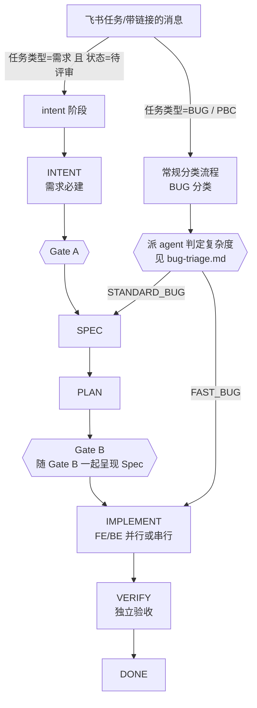

# 飞书任务开发流程

一个需求从飞书任务进来，到 MR 合并，走同一条流水线。

**本文件是地图**：给出阶段、产物、分工、状态流转的全貌，并指向每个环节的权威文件。
命令与细则不在本文件重复——重复就会漂移。

## 全流程

以下只画**带飞书任务链接**的分支。无任务链接、口述需求同样进「进入判定」一节的
常规分类，但没有飞书任务字段可读，不回写任何飞书状态。



判定标准、产物差异见 `skills/devflow/bug-triage.md`，此处不重复。

## 进入判定

用户提出开发需求（新增功能、改变行为、报 bug、口述问题、明确指派）即进入本流程；
纯咨询、只读代码解释不进入。

带飞书任务链接时，先读该任务的自定义字段判定入口：

- **`任务类型` = `需求` 且 `状态` = `待评审`** → 直接进 intent 阶段：读
  `skills/devflow/intent.md` 并按其执行，跳过常规 Bug/Feature 分类。
- **其他组合**（BUG / PBC，或状态不是待评审）→ 走常规分类流程。

判定读法（字段/选项 GUID 按租户生成，**禁止写死**，一律按 `name` 匹配；解析一次
写进持久记忆复用，guid 失配才重新解析）：

```bash
lark-cli task tasks get --task-guid <guid> --as bot --format json
# → data.task.custom_fields[]：拿「任务类型」「状态」两条的 guid + single_select_value
lark-cli task custom_fields get --custom-field-guid <字段guid> --as bot --format json
# → data.custom_field.single_select_setting.options[]：option guid → name
```

`feishu-task-reminder` hook 已在注入前跑过同一判定；查不到（接口失败）按未命中
处理，退回常规流程。

## 阶段 · 产物 · 分工

| 阶段 | 产物 | 执行方 | 怎么调 |
|---|---|---|---|
| Intake / 分类 / Discovery | — | 主上下文 | 见本文件「进入判定」一节 |
| **INTENT** | Intent 文档（容器节点下） | 主上下文 | `任务类型=需求 且 状态=待评审`，或判断 FEATURE 需要先定 Intent → 读 `skills/devflow/intent.md` 并按其执行 |
| ⏸ **Gate A** | — | **需求人** | 停下，把 Intent 呈现给用户确认 |
| SPEC | Spec 文档（容器节点下） | 主上下文 | Gate A 通过（FEATURE），或 DISCOVER 判定 `STANDARD_BUG` → 读 `skills/devflow/spec.md` 并按其执行 |
| PLAN | Plan 文档（容器节点下） | 主上下文 | Spec 定稿后 → 读 `skills/devflow/plan.md` 并按其执行 |
| ⏸ **Gate B** | — | **需求人** | 停下，把 Plan + Spec 呈现给用户确认（FEATURE 与 `STANDARD_BUG` 都要过） |
| IMPLEMENT | 代码 + MR | `frontend-developer` / `backend-developer` | 见下节「IMPLEMENT：单 Agent vs Agent Team」 |
| VERIFY | 验收结论 | `test-verifier` | Agent 工具 |
| DONE | — | 主上下文 | 汇总输出 |

**两个 Gate 不可跳过、不可自行批准。** 需求人是最终 Gate。

## IMPLEMENT：单 Agent vs Agent Team

判定路由前先读 Plan 文档的 Task Graph（不新派 agent 重新判断）：

- **存在跨 FE/BE 真实依赖链**（非纯 `∥` 并行）**或任务数 ≥ 3** → 走 Agent Team。
- **单任务，或 FE/BE 各自独立无依赖** → 走单 Agent（跟现在一样）。
- `FAST_BUG` 没有 Plan 文档，天然走单 Agent，不适用本判定。

**单 Agent 路径**：Agent 工具分别派 `frontend-developer` / `backend-developer`，
`subagent_type` 传对应名。

**Agent Team 路径**：

1. 把 Plan 里每张 Task Card 用 `TaskCreate` 建成任务，用 `TaskUpdate` 的
   `addBlockedBy`/`addBlocks` 复现 Task Graph 的依赖关系。
2. 用 Agent 工具派出对应 named agent，`name` 取 Task Card 编号（如
   `BE-01`/`FE-01`），`subagent_type` 传角色名——同一 session 内多个 named
   agent 自动构成隐式 team，`TaskList`/`SendMessage` 天然共享。
3. 各 agent 自己 `TaskList` 找自己的任务、做完 `TaskUpdate` 标记完成；契约或
   依赖交接上的分歧直接 `SendMessage` 对方（用 name），不必绕回主上下文。
4. 主上下文仍是唯一改飞书任务状态的角色（见下节「一律不改任务字段」），等全部
   任务完成后才进入 VERIFY——VERIFY 阶段不变，仍由主上下文直接派
   `test-verifier`，不并入 team。

## 飞书任务字段与状态流转

字段有哪些、`任务类型`+`状态` 怎么决定入口、状态怎么一步步回写：
`skills/devflow/state-transitions.md`。

**`frontend-developer` / `backend-developer` / `test-verifier` 一律不改任务
字段**——它们各自只做一段，无从判断整体进度，都去写会写出互相矛盾的状态。回写
统一归主上下文。

## 产物落在哪

落盘模型（目录结构、文档标题、章节命名）、配置与初始化流程、scope 清单：
`skills/devflow/artifact-config.md`。

## 身份

**产物与任务操作统一 `--as bot`**（token 不过期）。`--as user` 只出现在初始化的两步：
解析父节点 `wiki +node-get`、把 bot 加进知识空间 `wiki +member-add`。

bot 必须先在目标知识空间里，否则建不了容器节点/子文档——这是唯一的环境依赖。

## 典型走查

拿到一条「需求 / 待评审」任务，顺序是：

1. 回写 `待评审 → Intenting`（进 intent 阶段的第一件事）
2. 确认产物后端已初始化，没初始化先问用户
3. 定位或新建容器节点；调研代码库；产出 Intent 文档
4. **停下过 Gate A**，把 Intent 呈现给需求人
5. 通过后回写 `Intenting → 待开发`，产出 Spec + Plan 文档
6. **停下过 Gate B**，把 Plan + Spec 呈现给需求人
7. 通过后回写 `待开发 → 进行中`，派 FE/BE 实现；提交 MR 后回写 `进行中 → 待验证`
8. 派 `test-verifier` 独立验收；PASS 后回写 `待验证 → 已解决`
9. 汇总输出（分类 / AC 逐条结果 / 产物 URL / 剩余风险）

拿到一条「BUG / PBC」任务，判定为 `FAST_BUG`，顺序是：

1. DISCOVER：确认 Root Cause，判定 FAST_BUG（判定标准见 `bug-triage.md`）
2. 回写 `待评审 → 进行中`（没有 Intenting/待开发 中间态），派 FE/BE 实现；
   提交 MR 后回写 `进行中 → 待验证`
3. 派 `test-verifier` 独立验收；PASS 后回写 `待验证 → 已解决`
4. 汇总输出

拿到一条「BUG / PBC」任务，判定为 `STANDARD_BUG`，顺序是：

1. DISCOVER：确认 Root Cause，判定 STANDARD_BUG
2. 定位或新建容器节点（可能需要新建）；产出 Spec + Plan 文档
3. **停下过 Gate B**，把 Spec + Plan 呈现给需求人（`状态` 仍是 `待评审`，未变）
4. 通过后回写 `待评审 → 进行中`，派 FE/BE 实现；提交 MR 后回写 `进行中 → 待验证`
5. 派 `test-verifier` 独立验收；PASS 后回写 `待验证 → 已解决`
6. 汇总输出

三条走查 FAIL 处理一致：定位失败 AC → 确定责任域 → 派回对应 FE/BE 修 → 重验。
禁止 test-verifier 自己大规模改实现。

## 不做什么

- 不跳过 intent 直接开发（需求类任务）。
- 不自行批准 Gate、不自行续跑。
- 不发明需求人没提的产品行为；不确定就问，或记成 Open Question。
- 不让实现方自己宣布通过。
- 不把产物写到本地文件绕过飞书，不在未初始化时自行挑知识空间。
